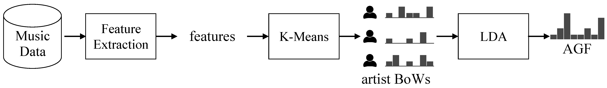

# Artist Group Factor processing



This repository contains the source code for extracting the Artist Group Factor (AGF), which is introduced in [this work](https://arxiv.org/abs/1805.02043). The process aims at extracting latent factors (or, simply, `labels`) of the artist of given music track, using various relavant information. More specifically, AGF is calculated from the artist model that represents the songs they released. The information source to build such a model can be the audio content, or music tag annotated per song, or even the lyrics (if available). In this particular work, we tested `mel frequency cepstral coefficients` and massive feature set from [`Essentia`](http://essentia.upf.edu/documentation/) and the `genres` annotated to the tracks. For detailed system description, please check the paper.

## Dependencies

The dependency of this program contains:

```
python3.X
numpy
scipy
pandas
scikit-learn
librosa
essentia
tqdm
```

Either you can install dependencies manually, or if you are using `conda`, you can also build a virtual environment with following command at the root of this repository.

```
$conda env create -f environment.yml
```

## Extraction

Main extraction process is separated in 2 steps. The first step is feature extraction part, where the features of each tracks into the desired output path. 

```
$python scripts/extract_features.py /path/to/audio/file/root/ /path/to/output/files/ --feature=FEATURE --n-workers=N
```

We are assuming (for demo purpose) that the audio files are located under one more sub-directories from the given root, (i.e. `/path/to/audio/file/root/subdir/song.mp3`), which is same organization with [FMA](https://github.com/mdeff/fma) dataset. Currently, we are providing only `mfcc`, `essentia` (Essentia's music extraction algorithm).

After the feature is extracted, AGF extraction can be done with following command

```
$python scripts/extract_agf.py agf_type /path/to/feature/root/ /path/to/metadata/track.csv /path/to/output/file.pkl
```

Currently, 4 modes of AGF are supported (`mfcc`, `dmfcc`, `essentia`, `subgenre`). The output file contains the dictionary where each key is each tracks id (as `track.csv` specifies) and value is the corresponding AGF.

One can load this values to targeting supervised feature learning model such as Neural Network or simply uses as another set of music features.

## Customization

The hyper parameter of the extraction process is setup in `agf/config.py`. One can freely test the different setup to obtain features and AGFs.

**NOTE** We haven't have chance to test various numbers on them, so please report to issue board if any there's any problem.

One can also change the processors such as dictionary learner and factor learner. Currently, the ones we are using are [`Mini Batch K-Means`](https://scikit-learn.org/stable/modules/generated/sklearn.cluster.MiniBatchKMeans.html) and [`Latent Dirichlet Allocation`](https://scikit-learn.org/stable/modules/generated/sklearn.decomposition.LatentDirichletAllocation.html#sklearn.decomposition.LatentDirichletAllocation') respectively. However, any decomposition methods can be substitute above models, according to the characteristics of the given data.

**NOTE** But the second factor model assumes the model can handle sparse matrix input (`scipy.sparse`)

## Referencing the work

If you want to use this program for any of your work, kindly refer our work with this bibtex

```
@inproceedings{DBLP:conf/www/KimWSL18,
  author    = {Jaehun Kim and
               Minz Won and
               Xavier Serra and
               Cynthia C. S. Liem},
  title     = {Transfer Learning of Artist Group Factors to Musical Genre Classification},
  booktitle = {Companion of the The Web Conference 2018 on The Web Conference 2018,
               {WWW} 2018, Lyon , France, April 23-27, 2018},
  pages     = {1929--1934},
  year      = {2018},
  crossref  = {DBLP:conf/www/2018c},
  url       = {https://doi.org/10.1145/3184558.3191823},
  doi       = {10.1145/3184558.3191823},
  timestamp = {Wed, 21 Nov 2018 12:44:12 +0100},
  biburl    = {https://dblp.org/rec/bib/conf/www/KimWSL18},
  bibsource = {dblp computer science bibliography, https://dblp.org}
}
```
